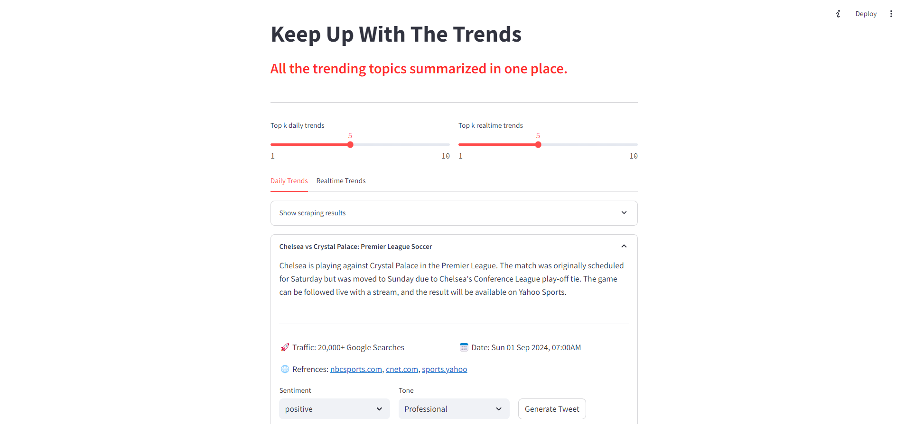
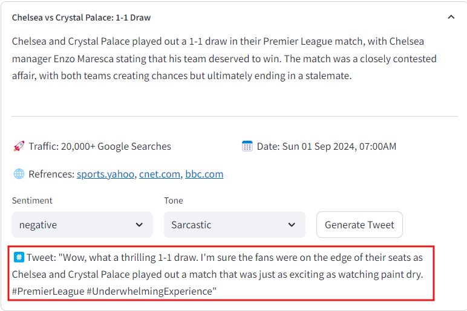
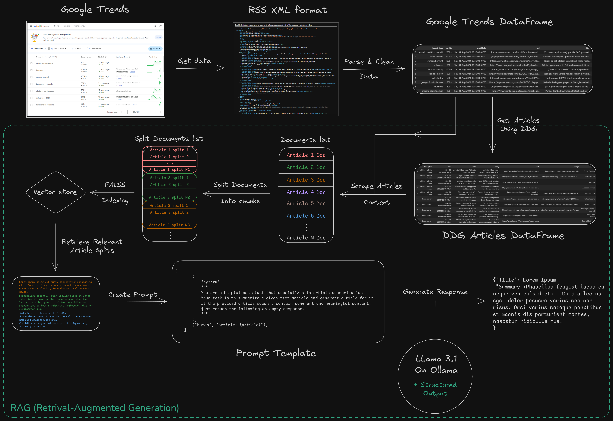

# Keep Up With The Trends
This web application is designed to get the latest trending topics from google trends, scrape relevant news articles and generate a summary for each topic.\
It utilizes a RAG pipeline with a Llama 3.1 8B model, to retrive relevant portions from the scraped articles and generate a summary and optionally a tweet. \
To achieve that, I used various libraries, including LangChain, and Sentence-Transformers, and duckduckgo_search.



Example of a tweet generation:



## Installation Steps
To run this web application and the notebook, follow these installation steps:
- With conda:
    1. conda create -n kuwtt pyton=3.10.14
    2. conda activate kuwtt
    3. pip install -r requirements.txt 
    4. pip install torch==2.3.1 --index-url https://download.pytorch.org/whl/cu118 
    5. [Download](https://ollama.com/download), Install & Run Ollama
- With venv:
    - On Linux:
        1. python3 -m venv kuwtt
        2. source kuwtt/bin/activate
        3. pip install -r requirements.txt
        4. pip install torch==2.3.1 --index-url https://download.pytorch.org/whl/cu118
        5. [Download](https://ollama.com/download), Install & Run Ollama
    - On windows:
        1. python -m venv kuwtt
        2. kuwtt\Scripts\activate
        3. pip install -r requirements.txt
        4. pip install torch==2.3.1 --index-url https://download.pytorch.org/whl/cu118
        5. [Download](https://ollama.com/download), Install & Run Ollama


## Usage
To use the streamlit web application, just open a command line interface in the web app directory `/streamlit_app`, then run the following command:

```console
streamlit run app.py
```

To use the notebook, simply open it in Jupyter Lab and follow the instructions provided in each cell.

On average, the notebook or the first run of the app takes around 5-7 minues to run.

**Remark:** The list of domains to skip is not final, so there will be cases where the scraper keeps on running without response. In which case, the urls should be manually investigated to locate the domain that's causing this issue (usually websites with newsletter subscription pop-up can cause this issue).

### Diagram of Auto-RAG Pipeline for articles scraping & summarization:

